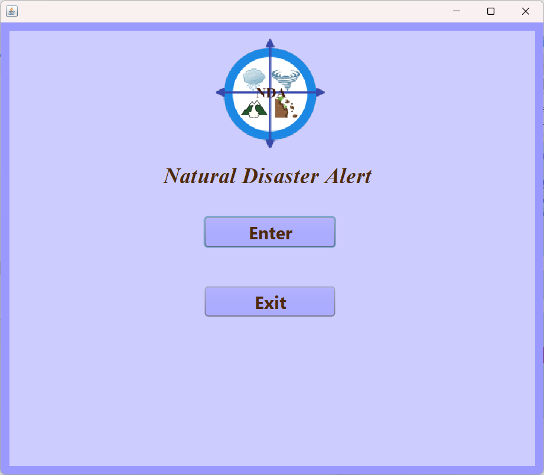
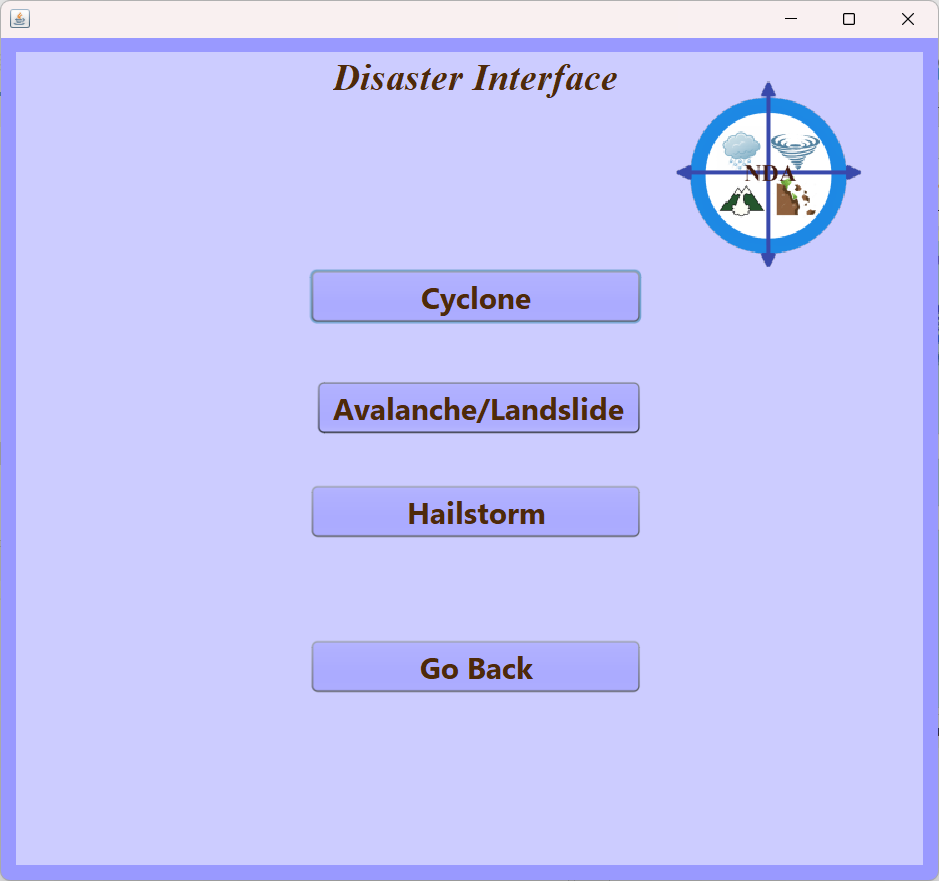
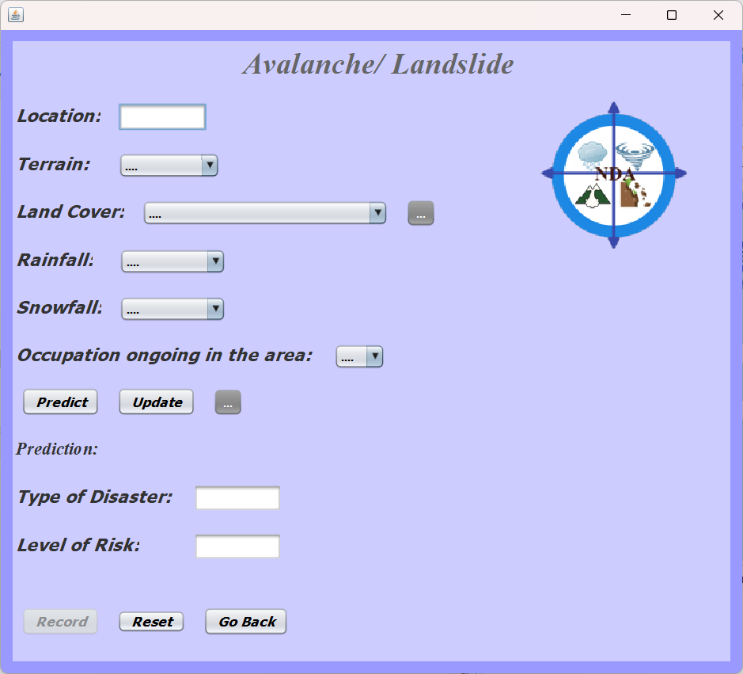
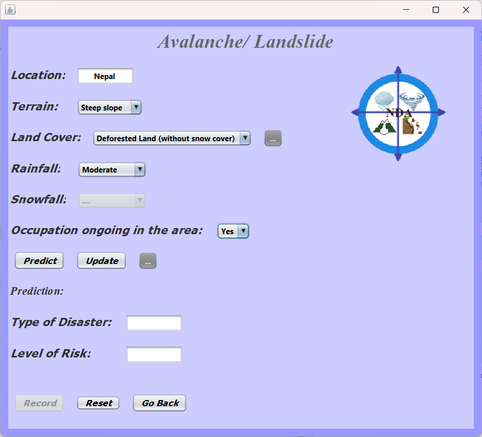
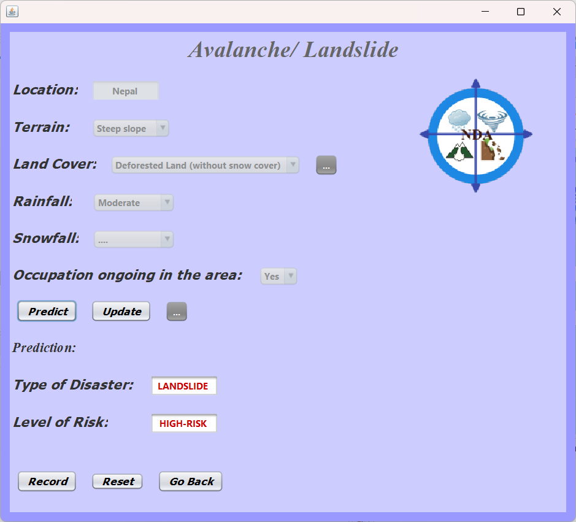

# Natural Disaster Alert 🌍🚨  

A Java-based application that provides real-time alerts for natural disasters, ensuring timely notifications and user safety.  

---

# 📌 Features  
- 📡 **Real-time alerts** for earthquakes, floods, and more  
- 🔔 **Notification system** for immediate disaster warnings  

---

# 🛠️ Tech Stack  
- **Language:** Java  
- **Libraries/Frameworks:** Apache NetBeans  

---

# 🚀 Setup & Installation  
1. Clone the repository:  
   ```bash
   git clone https://github.com/Sai25Hajime/Natural-Disaster-Alert.git
   cd Natural-Disaster-Alert
2. Compile and run the Java application:
   ```bash
   javac DisasterAlert.java  
   java DisasterAlert

---

# Screenshots






---

# 👩‍💻 Contributors/Collaborators  
- [Saileen Fernandes (@Sai25Hajime)](https://github.com/Sai25Hajime)
  
- [Yohan Mavely (@BlueLightningWizard)](https://github.com/BlueLightningWizard)  
